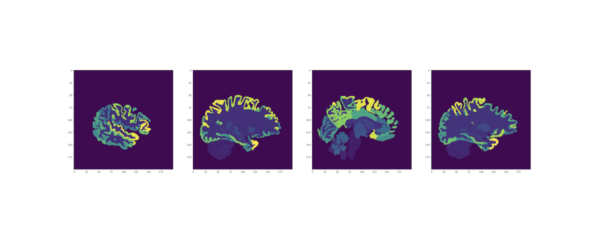

# SegNet - 3D brain segmentation with MICCAI 2012 DATASET

- python 3.7.4
- pytorch
- [paper_review](https://enfow.github.io/paper-review/segmentation/2020/04/01/deep_neural_networks_for_anatomical_brain_segmentation/)

## Architecture

**SegNet** is the 3D MRI image segmentation model proposed by Alexandre de Brebisson, Giovanni Montana in 2015. According to the paper, [Deep Neural Networks for Anatomical Brain Segmentation](https://arxiv.org/abs/1502.02445), the SegNet has the following architecture.

It has 8 pathways(six 2D patches, one 3D patch and centroid values of all regions). The model uses the convolution neural network to extract the features from  2D and 3D patches and the identity layer to extract features from centroid vector. After that, it concatenates all of the features from each pathway and passes it through the fully connected layers to make a classification decision. 
 
## Results

On the paper, the dice coefficient score of SegNet with MICCAI 2012 dataset is 0.725 and error rate is 0.163. The reproduction of this git repository code is about error rate of 0.2.

#### Test label image

#### Predict label image

As you can see, there is an label unbalancing issue with the size of the brain region and it greatly reduces the number of prediction labels. The issue makes not only poor results, but also hinders the learning of the next epoch because the model cannot find the exact centroid value. Experimentally these issue tends to grow with the number of layers in the model.
